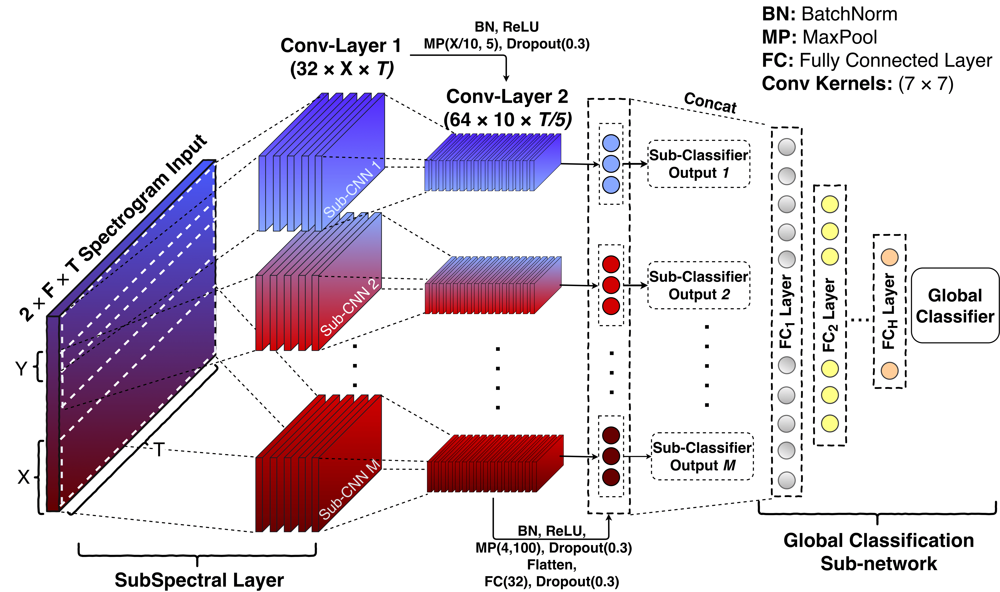
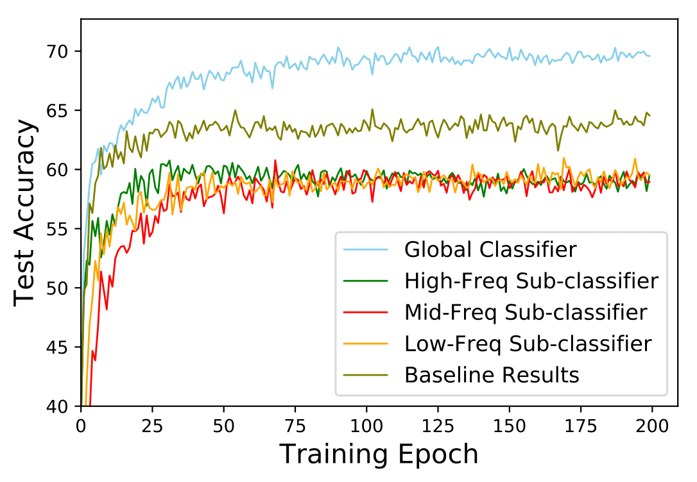

# SubSpectralNet - Using Sub-Spectrogram based Convolutional Neural Networks for Acoustic Scene Classification

This repository contains the source codes and miscellaneous figures for SubSpectralNet introduced in the following paper:

[SubSpectralNet - Using Sub-Spectrogram based Convolutional Neural Networks for Acoustic Scene Classification](https://arxiv.org/abs/1810.12642) (Submitted in ICASSP 2019) 

[Sai Samarth R Phaye](https://ssrp.github.io), [Emmanouil Benetos](http://www.eecs.qmul.ac.uk/~emmanouilb/), and [Ye Wang](https://www.smcnus.org/profile/ye-wang/).

[Click here for the presentation!](https://docs.google.com/presentation/d/1xyvpgGPkdrxgbBbEWvup5sPiajiWRdbQ7CZGd9nW0jY/)

We introduce a novel approach of using spectrograms in Convolutional Neural Networks in the context of acoustic scene classification. First, we show from the statistical analysis that some specific bands of mel-spectrograms carry discriminative information than other bands, which is specific to every soundscape. From the inferences taken by this, we propose SubSpectralNets in which we first design a new convolutional layer that splits the time-frequency features into sub-spectrograms, then merges the band-level features on a later stage for the global classification. The effectiveness of SubSpectralNet is demonstrated by a relative improvement of +14% accuracy over the DCASE 2018 baseline model. The detailed architecture of SubSpectralNet is shown below.

<p align = "center">

</p>
                                                 
If you have any queries regarding the code, please contact us on the following email: phaye.samarth@gmail.com (Sai Samarth R Phaye)

## Usage

Following are the steps to to follow for training the model on our implementation:

Before training the model, it is expected that you extract the log mel-energy magnitude spectrograms from the audio dataset. For this, we used the standard [DCASE 2018 Baseline Code](https://github.com/DCASE-REPO/dcase2018_baseline/) provided by the DCASE community. We use the publicly provided development dataset (Task 1A, DCASE 2018), which has 6122 two-channel 10-second samples for training and 2518 samples for testing. We used stereo information as the input to our model, with the same baseline parameters for spectrogram extraction (details in the [paper](https://arxiv.org/abs/1810.12642)), except for the number of mel-bins, which is set to either 200 or 40. Once the features (spectrograms) are extracted, the dimension should be (6122, 200, 500, 1) for training samples (two, one for each channel), (2518, 200, 500, 1) for testing and the corresponding one-hot vectors for both samples. They are loaded with the following names in the code: "X_train_left.npy", "X_train_right.npy", "X_validation_left.npy", "X_validation_right.npy", "Y_train.npy", "Y_validation.npy".

The SubSpectralNet.py code expects all the six files to be present in the same folder as that of the code. Once these steps are over, following are the steps to execute the code:

**Step 1.
Install [Keras>=2.0.7](https://github.com/fchollet/keras)
with [TensorFlow>=1.2](https://github.com/tensorflow/tensorflow) backend.**
```
pip install tensorflow-gpu
pip install keras
```

**Step 2. Clone the repository to local.**
```
git clone https://github.com/ssrp/SubSpectralNet.git SubSpectralNet
cd SubSpectralNet/code
```

**Step 3. Move the Numpy datasets**  
Move the Numpy dataset files extracted using DCASE baseline code in the current directory.

**Step 4. Train a SubSpectralNet**  

Training with default settings:
```
python SubSpectralNet.py
```
For more settings, the code is well-commented and it's easy to change the parameters looking at the comments. 

## Results
The results of the network are shared in Section 4 of the paper. Following is the accuracy curve obtained after training the model on 40 mel-bin magnitude spectrograms, 20 sub-spectrogram size and 10 mel-bin hop-size (72.18%, average-best accuracy in three runs).

<p align = "center">

</p>
                                          
#### Training Speed 

The training speed depends on the parameters that you set for SubSpectrogram size and mel-hop size, as they decide the final architecture of the network. For example, when the model is trained using Nvidia Tesla K80 card, on 200 mel-bin spectrograms, 20 sub-spectrogram size and 10 mel-bin hop-size, the time taken for one epoch is around 210s.


## Other Implementations

If you are writing code for SubSpectralNets in any other framework, please let us know and we'll be happy to share your link here.
